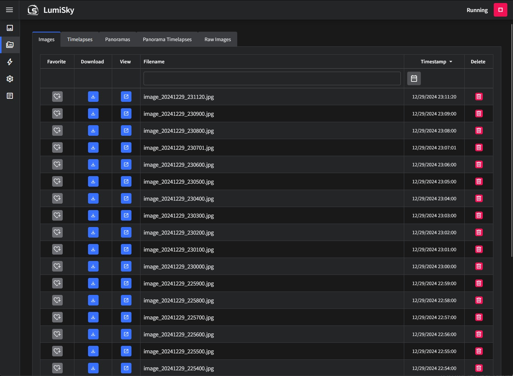

<!-- NOTE: This is a copy of README.md in the root of the repo with the image paths changed. -->

# Introduction

LumiSky is an astronomy allsky camera server for capturing images and generating timelapse videos.

LumiSky has been deployed at [SDSO](https://sdso.space/) since August 2024.

## Features

- Supports [INDI](https://www.indilib.org/) cameras
- Dusk/dawn transition auto exposure
- Automatic timelapse generation
- Panorama images and timelapse video
- 3D panorama image and video player
- Midtone autostretch
- Auto contrast enhance (S Curve)
- Accurate white balance
- Hot pixel correction
- Circle mask
- Customizable overlay
  - Cardinal directions
  - Timestamp
  - Latitude
  - Longitude
  - Elevation
  - Exposure
  - Gain
  - Sun altitude
  - Custom text
- FTP export
- Automatic cleanup of old data
- Import/export settings

## Requirements

- OS
  - Debian 12 (bookworm)
  - Windows 10/11
- CPU
  - x86_64
  - ARM64 (linux only)
- RAM
  - 2GB RAM recommended, 1GB minimum
  - More RAM is required depending on camera resolution
- Storage
  - Enough storage for images, panoramas, timelapse videos
- Camera
  - Any camera supported by [INDI](https://www.indilib.org/)
- INDI
  - v2.0.7 and up

LumiSky can be run as a:

- Docker container (recommended)
- LXC
- Virtual machine
- Native application

## Screenshots

### Dashboard

### Gallery

### 3D Panorama

[3D Panorama](_media/lumisky-3d-panorama.mp4 ':include')

### Settings

